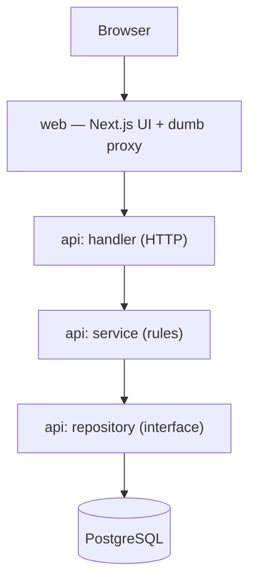
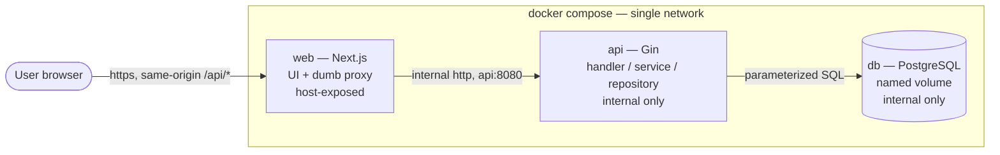
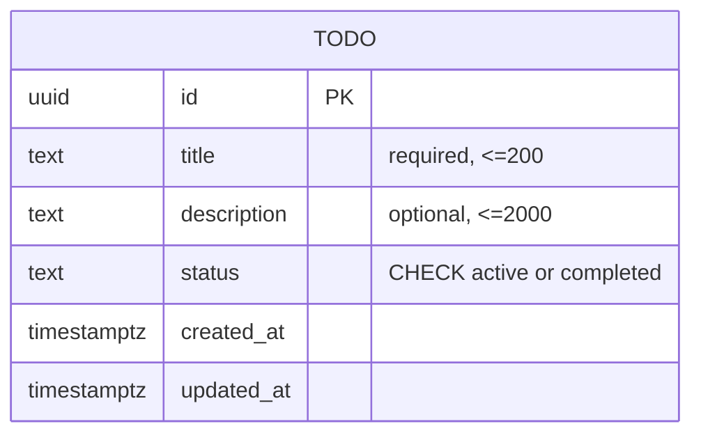

# Architecture Spine — todo-app

## Design Paradigm

**Layered client–server, three services, one direction of dependency.**

- **`web` — Next.js client + dumb BFF proxy.** React components render; TanStack Query owns server state; a thin proxy forwards `/api/*` to the API. Contains no business logic.
- **`api` — layered Gin service.** `handler → service → repository`. Handlers speak HTTP, services hold the rules, the repository interface wraps persistence. This is the sole owner of business logic and validation truth.
- **`db` — PostgreSQL.** Reached only through the repository.

Layers map to directories one-to-one (see Structural Seed). The paradigm's single load-bearing idea: **dependencies point inward and downward, never sideways or up** — the client depends on the API contract, never on Gin internals; handlers depend on services, services on the repository interface, and nothing depends back.

## Invariants & Rules

Dependency direction — the rule the whole build hangs on:



### AD-1 — Layered backend, one-way dependency

- **Binds:** all `api` work (Feature F, and the server side of A–E).
- **Prevents:** SQL in handlers; Gin imported by services; persistence logic scattered across the codebase.
- **Rule:** HTTP concerns live **only** in handlers; business rules (validation, status transitions, ordering) live **only** in services; **all** persistence goes through the repository interface. Dependencies flow `handler → service → repository` and never the reverse.

### AD-2 — The repository interface is the multi-user seam

- **Binds:** Feature F; NFR8 (extensibility to auth/multi-user).
- **Prevents:** a future `user_id` scoping requiring handler/service rewrites; a datastore migration touching business code.
- **Rule:** every persistence operation is a method on a Go **repository interface**. It stays *clean* today (no speculative scope parameter). Multi-user is added later by threading an owner scope through this one interface plus a `WHERE user_id = $1` — a change contained to repository + service only.

### AD-3 — The Next proxy is dumb; Gin owns all logic

- **Binds:** `web` proxy layer; the front/back boundary; NFR8, NFR10.
- **Prevents:** business logic or validation drifting into the Next runtime, recreating a two-owner split; a CORS surface.
- **Rule:** the browser calls **same-origin `web`**, which forwards `/api/*` to `api` on the internal network. The proxy is pure pass-through (its only future job is auth-session injection). **Gin is the single source of business rules and validation authority.** No reshaping, no rules, no data ownership in the proxy. It forwards `api` responses **verbatim** (status code + JSON body untouched); if `api` is unreachable or exceeds the proxy's request timeout, the proxy synthesizes an **AD-9-shaped error** (`502`/`504` with `{ error: { code, message } }`) — it never leaks an HTML error page or a thrown fetch to the browser.

### AD-4 — TanStack Query is the sole owner of server state

- **Binds:** all `web` data flow (Features A–E, G); SM3, NFR1, FR23, CM2.
- **Prevents:** components holding private copies of server truth; ad-hoc, inconsistent reconciliation; optimistic updates that silently hide server failures.
- **Rule:** todos live in the **query cache only**. Every mutating action (add/edit/toggle) is a mutation that pairs `onMutate` (apply optimistically) with `onError` (roll back visibly) and settles against the server. No component stores its own server-derived list.

### AD-5 — Pending-delete is a client-side lifecycle; only the commit crosses the network

- **Binds:** Feature E (FR13–FR15).
- **Prevents:** a server that must track "pending" state; a delete that fires before the undo window; a reappearing todo after reload.
- **Rule:** delete removes the row from the UI immediately and starts a client-side ~5s timer. **No normal network call during the window.** Undo cancels the timer with no round-trip. On elapse, the real `DELETE` fires. **On page unload/close with a delete still pending, the client flushes the `DELETE` via `navigator.sendBeacon` (or `fetch` with `keepalive: true`)** so the commit survives the tab closing — reload/close = committed, the todo does not reappear (FR15). The ~5s duration is a client-owned constant; the server never knows a delete was "pending."

### AD-6 — The todo wire contract is fixed and shared

- **Binds:** the `web ↔ api` boundary (all features).
- **Prevents:** the independently-built client and API diverging on field names, casing, shape, collection envelope, request bodies, or success codes.
- **Rule — resource shape.** A todo is exactly:

  ```json
  { "id": "uuid",
    "title": "string",
    "description": "string",
    "status": "active",
    "metadata": { "createdAt": "2026-07-17T14:03:11Z", "updatedAt": "2026-07-17T14:03:11Z" } }
  ```

  **camelCase on the wire** (Go structs carry `json` tags; Postgres columns stay `snake_case`). Timestamps are **nested under `metadata`**. Two text fields: **`title` (required)** and **`description` (optional)**. When there is no description, `description` is the **empty string `""`, never `null`** (so the client never branches on null).
- **Rule — collection.** `GET /todos` returns a **bare JSON array** of todos, and **`[]` (never `null`) when empty** — the Go handler must emit an empty slice, not a nil slice.
- **Rule — request bodies.** `POST /todos` body is `{ "title": "...", "description": "..." }` (`description` optional, defaults `""`); the server assigns `id`, `status` (defaults `active`), and timestamps, and **ignores any client-supplied `id`/`status`/`metadata`**. `PATCH /todos/:id` sends **only the fields being changed** from `{ title, description, status }`; an **absent field means unchanged** (decoded as optional/pointer, never a zero-value overwrite); any combination may be changed together in one atomic call.
- **Rule — success responses.** `POST` → `201` + the full created resource (the client needs it for AD-7's temp-id swap and relative-time render); `PATCH` → `200` + the full updated resource; `DELETE` → `204` (empty). A commit-`DELETE` that returns `404` (already gone) is treated as **success**, not an error.
- **Rule — enforcement (single source of truth).** The contract is not merely documented, it is **enforced from one shared type definition** that both `web` and `api` derive from (a `shared/` contract module, or types generated from a single schema). Field names, casing, envelope shape, and success codes trace to that one definition, so a client/API divergence surfaces as a **build/type error, not a runtime bug**. Neither side hand-maintains its own copy of the shape. *(Added 2026-07-17 — closes the "who enforces the fixed contract?" gap surfaced in test-design risk R3.)*

### AD-7 — Identity and timestamps are server-authoritative

- **Binds:** Feature F; the optimistic-add path (Feature A).
- **Prevents:** client-minted ids leaking into persistence; clock-skewed timestamps; count-leaking serial ids.
- **Rule:** `id` is a **server/DB-generated UUID v4**. On optimistic add the client mints a **temporary id**, the server returns the real UUID (in the `201` body, AD-6), the client **swaps it on settle** — temp ids are never persisted. `createdAt`/`updatedAt` are set **server-side, RFC3339 in UTC with a trailing `Z`, second precision** (e.g. `2026-07-17T14:03:11Z`); `updatedAt` updates on every create/edit/status change. The client renders relative time from `createdAt`; it never generates timestamps.

### AD-8 — `status` is an extensible text enum, not a native PG type

- **Binds:** Feature D; FR19 (extensibility).
- **Prevents:** an `ALTER TYPE` schema rewrite when `in_progress`/`archived` are added later.
- **Rule:** `status` is stored as Postgres `text` + a `CHECK` constraint (current values `active` | `completed`). The allowed-values list is kept in sync in exactly two places — the DB `CHECK` and Go service validation. Adding a state = editing that list, not migrating a type.

### AD-9 — One uniform error contract

- **Binds:** Feature F, Feature G (FR18, FR22, NFR9).
- **Prevents:** the client guessing at inconsistent error shapes; unhandled failures reaching the user.
- **Rule:** every non-2xx response is `{ "error": { "code": "...", "message": "..." } }` with an apt status. `code` is drawn from a **fixed vocabulary**: `validation_error` (`400`), `not_found` (`404`), `internal_error` (`500`; the proxy also emits it for `502`/`504`). Client handling **splits by class**: a **`4xx` validation error → inline feedback, no Retry** (the request is malformed; retrying is futile); a **`5xx` / network / timeout → the error state + Retry path (FR22)**. No raw exception surfaces to the user.

### AD-10 — Validation is server-authoritative, mirrored on the client

- **Binds:** Features A, C; FR3, FR11, FR24, NFR10.
- **Prevents:** the client being the only guard; client and server disagreeing on what is valid.
- **Rule:** validation is enforced **server-side (authoritative)** and **mirrored client-side** for instant feedback; a client-side check is never the sole gate. **`title` is required** — non-empty/non-whitespace, **≤200**; **`description` is optional** — may be blank, **≤2000**. To keep the mirror exact both caps are counted in **Unicode code points (runes)** (not UTF-16 units, not bytes), and **whitespace is trimmed before validation on both sides, cap applied after trim** — so the optimistically rendered text equals the persisted text. SQL is always parameterized; input is sanitized server-side.

### AD-11 — Schema evolves only through versioned migrations, applied on boot

- **Binds:** Feature F; NFR8, NFR11, CM3.
- **Prevents:** hand-run SQL; an ORM's implicit/unpredictable `AutoMigrate`; a create-once `init.sql` that can't evolve.
- **Rule:** every schema change is a versioned `golang-migrate` up/down SQL file under `api/migrations/`, embedded in the `api` binary and **applied automatically on startup before it serves**. No manual schema steps — `docker compose up` stays zero-touch.

### AD-12 — Deployment & config envelope

- **Binds:** whole system; NFR3, NFR7, NFR11, CM3.
- **Prevents:** the API/DB being publicly reachable; `api` racing an unready `db`; secrets in the repo; any required manual configuration.
- **Rule:** three compose services — `web`, `api`, `db`. **Only `web` exposes a host port** (the sole entry point); `api` and `db` are internal-only. `db` uses a **named volume**, and **todo data survives `docker compose down` + `up`** — the volume must actually mount; a silent mount failure that quietly starts empty is a durability defect, not acceptable (test-design risk R6). Startup is healthcheck-gated: `db` healthy → `api` (migrate, then serve; readiness exposed at **`GET /health`**) → `web`. Config is **12-factor env vars with working defaults baked into compose** so bare `docker compose up` just works; `.env.example` documents them; **no secrets committed**.

## Consistency Conventions

| Concern | Convention |
| --- | --- |
| Naming | Wire/JSON: camelCase. Go: exported PascalCase + `json` tags. Postgres: snake_case tables/columns. REST paths: lowercase plural noun (`/todos`). |
| Endpoints | `GET /todos` · `POST /todos` · `PATCH /todos/:id` (partial: any of title / description / status) · `DELETE /todos/:id` · `GET /health` (readiness: reports migrated + serving; drives the compose healthcheck and CI E2E gating). `PATCH` (not `PUT`). Unversioned. |
| List ordering | Server returns newest-first with a deterministic tiebreak (`ORDER BY created_at DESC, id DESC`, FR8). The client **never** re-sorts, and optimistic-add **prepends** the new todo so its position matches the server on settle. |
| IDs & dates | `id` = UUID v4 (server). Timestamps = RFC3339 UTC (server). Relative time is a client render concern only. |
| Error shape | `{ error: { code, message } }` + apt HTTP status. Client renders as non-disruptive error state + retry. |
| State & mutation | Server state → TanStack Query cache only (client). Business state & transitions → Gin services only. Optimistic apply always paired with rollback. |
| Config & secrets | 12-factor env; defaults in compose; `.env.example`; no secrets committed. |
| Logging | Structured logging in `api`; a React error boundary in `web`. No unhandled error reaches the user. |
| Security | Parameterized SQL only; server-side sanitization authoritative; rely on React's default output-escaping for XSS on render. |
| Tooling / quality gate | Linter + formatter config committed and CI-checkable (NFR6): `eslint` + `prettier` in `web`, `gofmt` + `golangci-lint` in `api`. |
| Responsiveness | `web` is responsive, mobile-first from ~375px up (SM4, NFR5). A `web`-internal concern — detailed at UX/story level, not a cross-unit invariant. |

## Stack

| Name | Version |
| --- | --- |
| Next.js (React client) | 16.2 LTS |
| TanStack Query (`@tanstack/react-query`) | 5.x |
| Go | 1.26 |
| Gin (`gin-gonic/gin`) | 1.12 |
| golang-migrate | 4.x |
| PostgreSQL | 18 |
| Docker Compose | current |

*Seed — verified current at authoring (Jul 2026); the code owns these once it exists.*

## Structural Seed

**Runtime / deployment topology** — only `web` is reachable from outside:



**Core entity** — one table today; the seam (AD-2) admits an owner later:



**Source tree** (monorepo):

```text
todo-app/
  web/                  # Next.js client + dumb BFF proxy (no business logic)
    app/                # routes, components, error boundary
    lib/                # TanStack Query client, api proxy handlers, pending-delete controller
  api/                  # Gin service
    handler/            # HTTP: parse, map errors -> status codes; GET /health readiness route
    service/            # rules: validation, status transitions, ordering
    repository/         # persistence interface + Postgres impl (multi-user seam; test seed/reset lives here)
    migrations/         # versioned golang-migrate SQL (up/down)
  shared/               # single source-of-truth wire-contract type (AD-6); web + api both derive from it
  docker-compose.yml    # web (exposed) + api + db (internal), healthcheck-gated
  .env.example
  README.md             # clone -> run in <=10 min
```

## Capability → Architecture Map

| Capability / Feature | Lives in | Governed by |
| --- | --- | --- |
| A — Task Capture (create, optimistic) | `web` mutation + `api` POST | AD-4, AD-6, AD-7, AD-10 |
| B — Task List (view, newest-first) | `web` query + `api` GET | AD-4, AD-6, ordering convention |
| C — Task Editing (inline, optimistic) | `web` mutation + `api` PATCH | AD-4, AD-6, AD-10 |
| D — Task Completion (status toggle) | `web` mutation + `api` PATCH | AD-4, AD-8 |
| E — Delete with Undo (pending-delete) | `web` pending-delete controller + `api` DELETE | AD-5, AD-4 |
| F — Persistence & API (CRUD, durable) | `api` handler/service/repository + `db` | AD-1, AD-2, AD-6, AD-9, AD-11, AD-12 |
| G — Resilience & Feedback (states) | `web` query/mutation states + `api` errors | AD-4, AD-9, AD-10 |

## Deferred

- **Testing conventions** — being defined in a separate test-design step; not fully fixed here. Two testability seams are, however, load-bearing and should exist from the start: (1) a **test-only seed/reset path** through the repository (test profile only, never prod-reachable) so integration/E2E can set list states and reset between runs [TC1]; (2) the **shared wire-contract type** (AD-6 enforcement rule) that `web` and `api` both derive from [TC6/R3].
- **Optimistic concurrency / conflict resolution** — v1 is single-user, so last-write-wins is acceptable; `updatedAt` exists but no version check. Revisit when multi-user (AD-2) lands.
- **Auth & multi-user** — the seam (AD-2) and the proxy auth-injection point (AD-3) are prepared, not built. Revisit when a `user_id` dimension is required.
- **API versioning** — unversioned today; add a prefix when a breaking contract change is real.
- **Accessibility** — PRD-deferred (keyboard operability, screen-reader labels). Not an architectural blocker.
