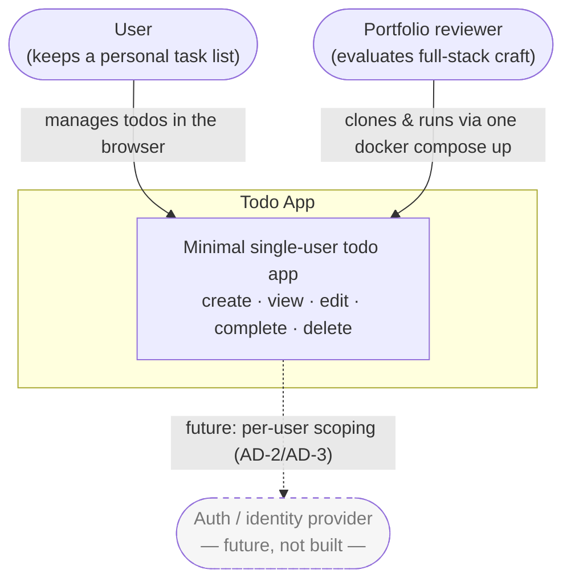
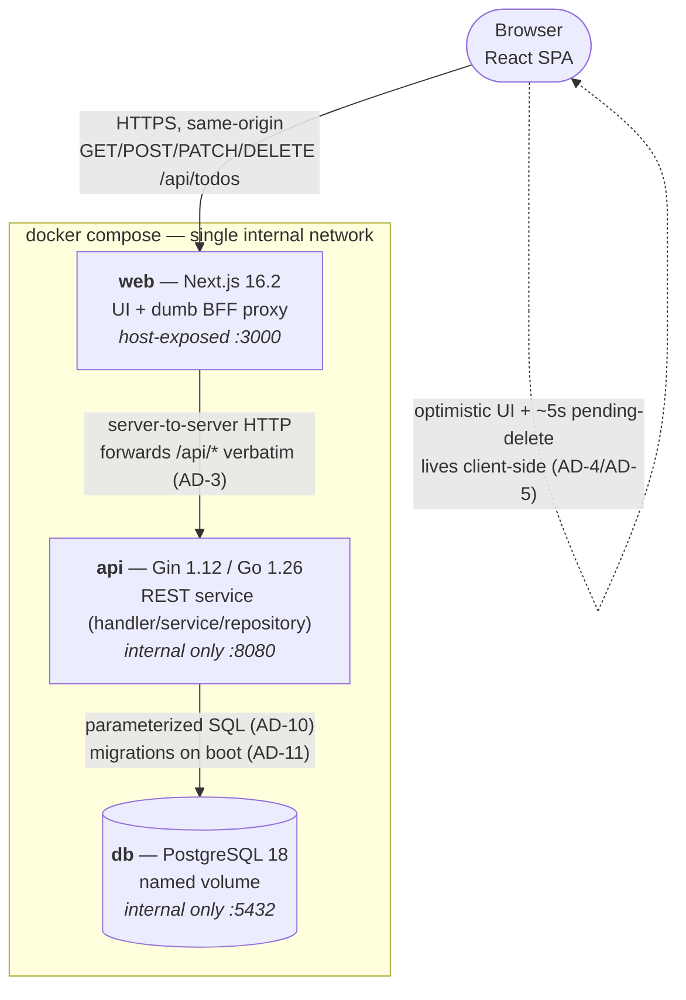
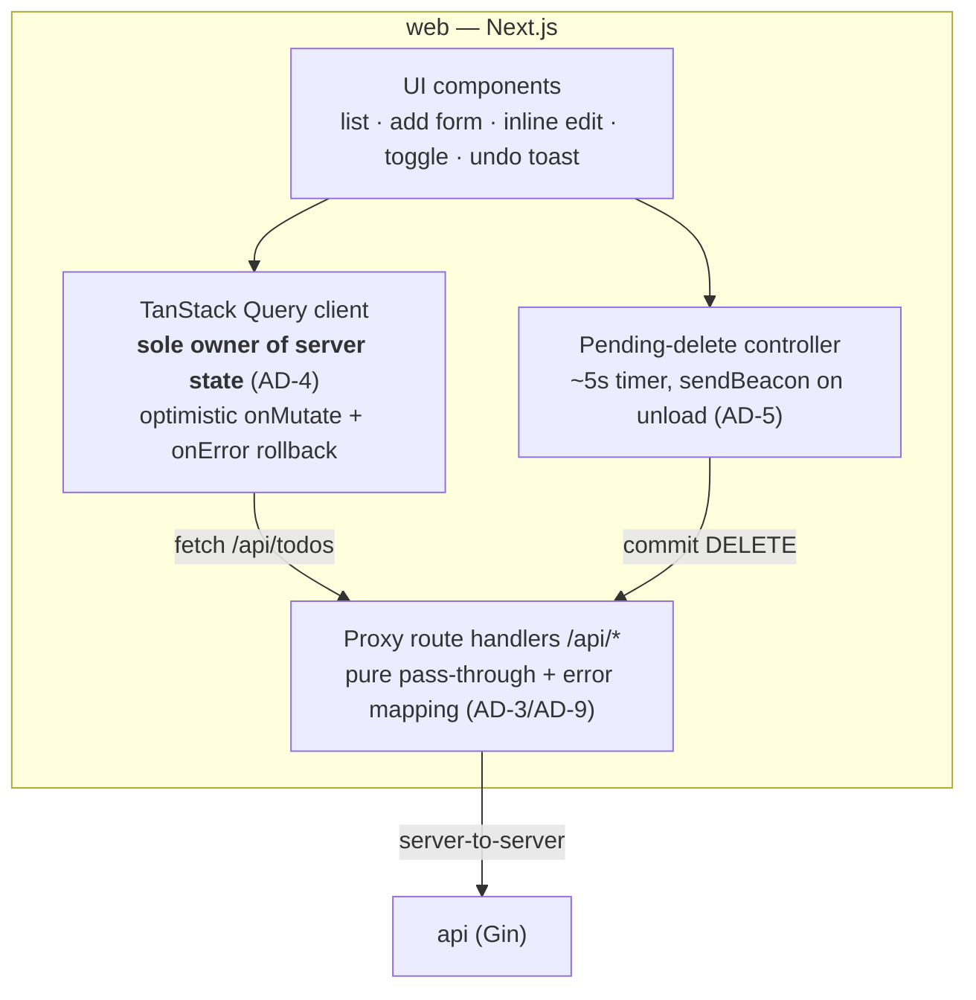
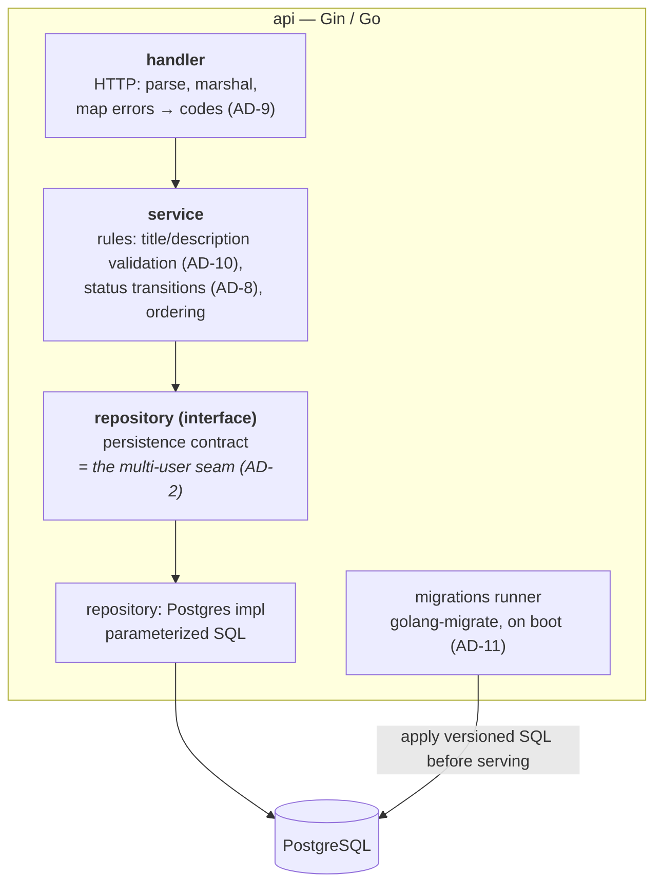

# todo-app — C4 Model

A visual walkthrough of the architecture, from system context down to components. Companion to `ARCHITECTURE-SPINE.md`; the spine's `AD-n` invariants are cited where they govern a boundary. Diagrams are valid Mermaid.

---

## Level 1 — System Context

Who uses the system and what it depends on. The whole todo-app is one system today; auth/multi-user is a deliberately deferred future dependency (spine AD-2, AD-3).

---

## Level 2 — Containers

The three deployable services and the browser. Only `web` is reachable from outside the Compose network; `api` and `db` are internal (spine AD-12). The browser never talks to `api` directly — it goes through the dumb BFF proxy in `web` (AD-3).

**Startup order** (healthcheck-gated, AD-12): `db` healthy → `api` runs migrations then serves → `web`.

---

## Level 3a — Components: `web`

React rendering, one server-state owner (TanStack Query), the bespoke pending-delete controller, and the thin proxy. No business logic lives here (AD-3).

---

## Level 3b — Components: `api`

Strict one-way layering (AD-1): HTTP in the handler, rules in the service, all persistence behind the repository interface — which is also the multi-user seam (AD-2).

---

## Reading the diagrams

- **Dependencies point down** — never up or sideways (AD-1). The browser depends on the wire contract (AD-6), never on Gin internals.
- **One entry point** — everything external enters through `web`; `api` and `db` are unreachable from the host (AD-12).
- **State ownership is singular** — server truth in the query cache on the client, business rules in `api` services, persistence behind the repository. No shared ownership.
- **The dashed edges are the future** — auth/multi-user attaches at the repository seam (AD-2) and the proxy's auth-injection point (AD-3) without disturbing the layers above.
